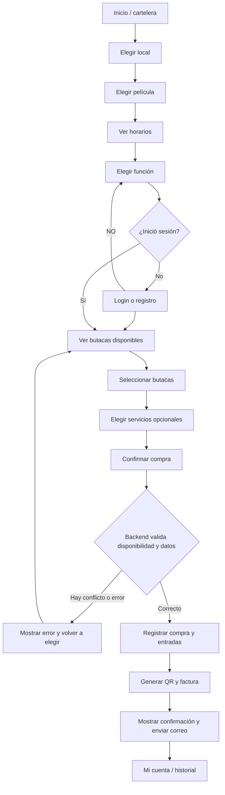

# Flujo de compra de entradas

Este es el recorrido principal que conviene implementar y probar de punta a punta.

## Diagrama de navegación

```mermaid
flowchart TD
    A[Inicio / cartelera] --> B[Elegir local]
    B --> C[Elegir película]
    C --> D[Ver horarios]
    D --> E[Elegir función]

    E --> I{¿Inició sesión?}
    I -- No --> J[Login o registro]
    J --> F
    J -- NO --> E
    I -- Sí --> F

    F[Ver butacas disponibles] --> G[Seleccionar butacas]
    G --> H[Elegir servicios opcionales]
    H --> K[Confirmar compra]

    K --> L{Backend valida disponibilidad y datos}
    L -- Hay conflicto o error --> M[Mostrar error y volver a elegir]
    M --> F
    L -- Correcto --> N[Registrar compra y entradas]
    N --> O[Generar QR y factura]
    O --> P[Mostrar confirmación y enviar correo]
    P --> Q[Mi cuenta / historial]
```

